# UML Design for Online Discussion Forums

## Class Diagram

```mermaid
classDiagram
    class Website {
        +addForum(Forum f) void
        +addUser(User u) void
        +getForum(String forumId) Forum
        +getForums() ArrayList~Forum~
        +getRegisteredUsers() ArrayList~User~
    }

    class User {
        -String userId
        -String name
        -String email
        +createForum(String name, String description) Forum
        +joinForum(Forum f) boolean
        +leaveForum(Forum f) boolean
        +sendInvitation(Invitation i) void
        +receiveInvitation(Invitation i) void
        +getName() String
        +getEmail() String
        +getUserId() String
        +getJoinedForums() ArrayList~Forum~
    }

    class Forum {
        -String forumId
        -String name
        -String description
        -User owner
        -User moderator
        +addMember(User u) boolean
        +removeMember(User u) boolean
        +createThread(String subject, String content, User author) Thread
        +postMessage(Message m) boolean
        +getAllMessages() ArrayList~Message~
        +filterMessagesByAuthor(User author) ArrayList~Message~
        +filterMessagesByThread(Thread thread) ArrayList~Message~
        +filterMessagesByDate(Date date) ArrayList~Message~
        +filterMessagesByDateRange(Date start, Date end) ArrayList~Message~
        +sortMessagesByAuthor(ArrayList~Message~ msgs) ArrayList~Message~
        +sortMessagesByDate(ArrayList~Message~ msgs, boolean ascending) ArrayList~Message~
        +reviewMessage(Message m) void
        +approveMessage(Message m) boolean
        +denyMessage(Message m) boolean
        +resign() void
        +inviteUser(User u) Invitation
        +inviteModerator(User member) Invitation
        +inviteNewOwner(User member) Invitation
        +deleteForum() void
        #setOwner(User u) boolean
        #setModerator(User u) boolean
        +getOwner() User
        +getModerator() User
        +getMembers() ArrayList~User~
        +getThreads() ArrayList~Thread~
        +getPendingMessages() ArrayList~Message~
    }

    class Thread {
        -String threadId
        -String subject
        -Message initiatingMessage
        -Forum forum
        +addMessage(Message m) void
        +getInitiatingMessage() Message
        +getMessages() ArrayList~Message~
        +getSubject() String
        +getForum() Forum
        +getThreadId() String
    }

    class Message {
        -String messageId
        -String content
        -User author
        -Date timestamp
        -Thread thread
        -boolean isApproved
        +getAuthor() User
        +getContent() String
        +getTimestamp() Date
        +getThread() Thread
        +getMessageId() String
        #approve() void
        #deny() void
        +isApproved() boolean
    }

    class Invitation {
        -String invitationId
        -String type
        -User sender
        -User recipient
        -String status
        -Forum forum
        -Date dateSent
        +accept() void
        +reject() void
        +getSender() User
        +getRecipient() User
        +getStatus() String
        +getType() String
        +getForum() Forum
        +getInvitationId() String
        +getDateSent() Date
        #setStatus(String status) void
    }


    Website "1" o-- "0..*" Forum : hosts
    Website "1" o-- "0..*" User : manages
    User "0..*" -- "0..*" Forum : memberOf
    Forum "0..*" --> "1" User : owner
    Forum "0..*" --> "1" User : moderator
    Forum "1" *-- "0..*" Thread : contains
    Forum "1" o-- "0..*" Message : pendingMessages
    Thread "1" *-- "1..*" Message : contains
    Message "*" --> "1" User : author
    Message "*" --> "1" Thread : belongsTo
    Thread "*" --> "1" Forum : belongsTo
    User "1" --> "0..*" Invitation : sends
    User "1" --> "0..*" Invitation : receives
    Forum "1" --> "0..*" Invitation : relatedTo
```

## Class Descriptions

### Website
The main class that hosts all forums and manages registered users.
- **Attributes:**
  - `forums`: List of all forums hosted on the website
  - `registeredUsers`: List of all registered users
- **Methods:**
  - `addForum()`: Adds a new forum to the website
  - `addUser()`: Registers a new user
  - `getForum()`: Retrieves a forum by its ID
  - `getForums()`: Retrieves all forums
  - `getRegisteredUsers()`: Retrieves all registered users

### User
Represents a registered user on the website.
- **Attributes:**
  - `userId`: Unique identifier for the user
  - `name`: User's name
  - `email`: User's email address
  - `joinedForums`: List of forums user is member of
  - `sentInvitations`: List of invitations user has sent
  - `receivedInvitations`: List of invitations user has received
- **Methods:**
  - `createForum()`: Creates a new forum (user becomes owner and first member)
  - `joinForum()`: Joins an existing forum as a member
  - `leaveForum()`: Leaves a forum (member removal)
  - `sendInvitation()`: Records an invitation sent by this user
  - `receiveInvitation()`: Records an invitation received by this user
  - `getName()`: Retrieves user's name
  - `getEmail()`: Retrieves user's email
  - `getUserId()`: Retrieves user's identifier
  - `getJoinedForums()`: Retrieves forums user is member of

### Forum
Represents a discussion forum with members, threads, and messages.
- **Attributes:**
  - `forumId`: Unique identifier for the forum
  - `name`: Name of the forum
  - `description`: Description of the forum's purpose
  - `owner`: The user who owns the forum
  - `moderator`: The user who moderates the forum
  - `members`: List of forum members
  - `threads`: List of discussion threads
  - `pendingMessages`: List of messages waiting for moderator approval
  - `pendingInvitations`: List of pending invitations for this forum
- **Methods (Public):**
  - `addMember()`: Adds a new member to the forum
  - `removeMember()`: Removes a member from the forum (used when member leaves)
  - `createThread()`: Creates a new discussion thread
  - `postMessage()`: Posts a message to the forum (goes to pending queue)
  - `getAllMessages()`: Retrieves all approved messages in forum
  - `filterMessagesByAuthor()`: Returns messages by specific author
  - `filterMessagesByThread()`: Returns messages in specific thread
  - `filterMessagesByDate()`: Returns messages on specific date
  - `filterMessagesByDateRange()`: Returns messages within date range
  - `sortMessagesByAuthor()`: Sort messages alphabetically by author name
  - `sortMessagesByDate()`: Sort messages chronologically
  - `reviewMessage()`: Review pending message (moderator)
  - `approveMessage()`: Pass message through to forum (moderator)
  - `denyMessage()`: Reject message (moderator)
  - `resign()`: Resign as moderator, owner becomes new moderator (moderator)
  - `inviteUser()`: Send email invitation to join forum (owner)
  - `inviteModerator()`: Invite member to become moderator (owner)
  - `inviteNewOwner()`: Invite member to take ownership (owner)
  - `deleteForum()`: Remove forum entirely (owner)
  - `getOwner()`: Retrieves the forum owner
  - `getModerator()`: Retrieves the forum moderator
  - `getMembers()`: Retrieves list of members in forum
  - `getThreads()`: Retrieves threads in forum
  - `getPendingMessages()`: Retrieves messages awaiting approval
- **Methods (Protected):**
  - `setOwner()`: Internal method to transfer ownership
  - `setModerator()`: Internal method to change moderator

### Thread
Represents a discussion thread containing related messages.
- **Attributes:**
  - `threadId`: Unique identifier for the thread
  - `subject`: Subject/title of the thread
  - `initiatingMessage`: The first message that started the thread
  - `messages`: List of all messages in the thread
  - `forum`: The forum this thread belongs to
- **Methods:**
  - `addMessage()`: Adds a message to the thread
  - `getInitiatingMessage()`: Returns the first message in thread
  - `getMessages()`: Retrieves all messages in the thread
  - `getSubject()`: Returns the subject of the thread
  - `getForum()`: Returns the forum this thread belongs to
  - `getThreadId()`: Returns the thread identifier

### Message
Represents a single message posted by a user.
- **Attributes:**
  - `messageId`: Unique identifier for the message
  - `content`: The text content of the message
  - `author`: The user who posted the message
  - `timestamp`: When the message was posted
  - `thread`: The thread this message belongs to
  - `isApproved`: Whether the moderator has approved this message
- **Methods (Public):**
  - `getAuthor()`: Returns the user who posted the message
  - `getContent()`: Returns the text content of the message
  - `getTimestamp()`: Returns when the message was posted
  - `getThread()`: Returns the associated thread
  - `getMessageId()`: Returns the message identifier
  - `isApproved()`: Checks if message is approved
- **Methods (Protected):**
  - `approve()`: Marks the message as approved (called by moderator)
  - `deny()`: Marks the message as denied (called by moderator)
 
### Invitation
Represents an invitation sent between users related to a forum.
- **Attributes:**
  - `invitationId`: Unique identifier for the invitation
  - `type`: Type of invitation (member, moderator, owner)
  - `sender`: The user who sent the invitation
  - `recipient`: The user who received the invitation
  - `status`: Invitation status (pending, accepted, rejected)
  - `forum`: The forum associated with the invitation
  - `dateSent`: When the invitation was sent
- **Methods (Public):**
  - `accept()`: Accepts the invitation (triggers appropriate action)
  - `reject()`: Rejects the invitation
  - `getSender()`: Returns the sender
  - `getRecipient()`: Returns the recipient
  - `getStatus()`: Returns the invitation status
  - `getType()`: Returns the invitation type
  - `getForum()`: Returns the associated forum
  - `getInvitationId()`: Returns the invitation identifier
  - `getDateSent()`: Returns when invitation was sent
- **Methods (Protected):**
  - `setStatus()`: Internal method to update invitation status

## Data Structure Implementation Table

| Data Structure | Class |
|----------------|-------|
| `ArrayList<Forum> forums` | Website |
| `ArrayList<User> registeredUsers` | Website |
| `ArrayList<Forum> joinedForums` | User |
| `ArrayList<Invitation> sentInvitations` | User |
| `ArrayList<Invitation> receivedInvitations` | User |
| `ArrayList<User> members` | Forum |
| `ArrayList<Thread> threads` | Forum |
| `ArrayList<Message> pendingMessages` | Forum |
| `ArrayList<Invitation> pendingInvitations` | Forum |
| `ArrayList<Message> messages` | Thread |

---

## Implementation Status

### ✅ Completed 
- [x] **Core Classes**: Website, User, Forum, Thread, Message (Part 1)
- [x] **Message Filtering and Sorting**: All filter and sort methods added to Forum class (Part 2)
- [x] **Invitation System**: Complete Invitation class with accept/reject functionality (Part 2)
- [x] **Moderator Functionality**: Review, approve, deny, and resign methods implemented (Part 2)
- [x] **Owner Functionality**: Invite methods and deleteForum() added (Part 2)
- [x] **Pending Message Queue**: Added to Forum class for moderation workflow (Part 2)
- [x] **Access Level Specifications**: Protected modifiers for internal methods, public for external API (Final)
- [x] **Relationship Refinements**: Composition, aggregation, and directed associations properly marked (Final)
- [x] **Data Structure Table**: Complete with 10 entries for all major associations (Final)
- [x] **Additional Methods**: Getter methods and helper methods added throughout (Final)

### 📋 Design Complete
All required components per assignment specification have been implemented:
- ✅ Object-oriented design with separate responsibilities
- ✅ Appropriate entity representations (classes, no interfaces/abstract classes needed)
- ✅ Key attributes with data types
- ✅ Operations with parameters and return values
- ✅ Access levels (public/protected/private) specified
- ✅ Relationships with multiplicities
- ✅ Composition vs aggregation distinguished
- ✅ Directed vs bidirectional associations marked
- ✅ Complete data structure supplement table with Java types and class locations

### 📄 Next Step: PDF Generation
Convert this document to PDF as `forums_uml.pdf` for submission to Autolab.

---

## Design Notes

### Composition vs Aggregation Guidelines
- **Composition (filled diamond ◆)**: Part cannot exist without whole
  - Thread contains Messages: If thread deleted, messages deleted
  - Forum contains Threads: If forum deleted, threads deleted
  
- **Aggregation (hollow diamond ◇)**: Part can exist independently
  - Website aggregates Forums: Forums can exist if website reference removed
  - User aggregates Forums (membership): User can exist without forum membership

### Relationship Details Explained

**Composition (◆) - Part cannot exist without whole:**
- `Forum *-- Thread`: Threads are owned by forums; if forum is deleted, all threads are deleted
- `Thread *-- Message`: Messages belong to threads; if thread is deleted, messages are deleted

**Aggregation (◇) - Part can exist independently:**
- `Website o-- Forum`: Forums can conceptually exist even if website reference is removed
- `Website o-- User`: Users can exist independently of website aggregation
- `Forum o-- Message (pendingMessages)`: Pending messages can be approved/denied without deletion

**Directed Association (→) - Unidirectional navigation:**
- `Forum --> User (owner/moderator)`: Forum knows its owner/moderator, but User doesn't directly track which forums they own/moderate (tracked via joinedForums and role comparison)
- `Message --> User (author)`: Message knows its author
- `Message --> Thread`: Message knows its thread
- `Thread --> Forum`: Thread knows its forum
- `Invitation --> User/Forum`: Invitation knows sender, recipient, and related forum

**Bidirectional Association (--) - Both sides aware:**
- `User -- Forum (memberOf)`: Both User and Forum maintain membership lists; navigable from both directions

**Multiplicities:**
- `Thread "1" *-- "1..*" Message`: Every thread must have at least one message (the initiating message)
- `Forum "1" *-- "0..*" Thread`: Forum can have zero or more threads
- `User "0..*" -- "0..*" Forum`: Many-to-many relationship for membership
- All other multiplicities reflect the business rules specified

### Access Level Decisions

**Public (+):** All methods that external classes need to call (getters, business logic methods)

**Protected (#):** Internal methods that should only be called by the class itself or package:
- `Forum.setOwner()` / `Forum.setModerator()`: Should only be called via invitation acceptance, not directly
- `Message.approve()` / `Message.deny()`: Should only be called via Forum moderation methods
- `Invitation.setStatus()`: Should only be called via accept/reject methods

**Private (-):** All attributes to ensure encapsulation

### Design Decisions
- **Owner/Moderator as References**: Owner and Moderator are User references, not separate role classes, for simplicity and flexibility
- **Invitation Handling**: Centralized in Invitation class rather than distributed across User/Forum for separation of concerns
- **Message Approval**: Handled via boolean flag rather than separate state machine for simplicity
- **Filtering/Sorting**: Methods return new ArrayLists rather than modifying originals for immutability
- **No Abstract Classes/Interfaces**: Current design doesn't require them; all users have same capabilities, object types are concrete
- **Moderator Queue**: Pending messages stored in Forum for centralized moderation access

