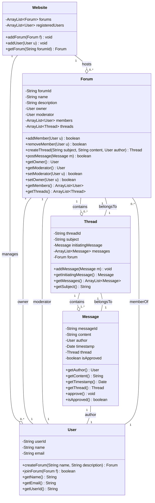

# UML Design for Online Discussion Forums

## Class Diagram

## Class Descriptions

### Website
The main class that hosts all forums and manages registered users.
- **Attributes:**
  - `forums`: List of all forums hosted on the website
  - `registeredUsers`: List of all registered users
- **Methods:**
  - `addForum()`: Adds a new forum to the website
  - `addUser()`: Registers a new user
  - `getForum()`: Retrieves a forum by its ID

### User
Represents a registered user on the website.
- **Attributes:**
  - `userId`: Unique identifier for the user
  - `name`: User's name
  - `email`: User's email address
- **Methods:**
  - `createForum()`: Creates a new forum (user becomes owner and first member)
  - `joinForum()`: Joins an existing forum as a member

### Forum
Represents a discussion forum with members, threads, and messages.
- **Attributes:**
  - `forumId`: Unique identifier for the forum
  - `name`: Name of the forum
  - `description`: Description of the forum's purpose
  - `owner`: The user who owns the forum
  - `moderator`: The user who moderates the forum
  - `members`: List of forum members
  - `threads`: List of discussion threads
- **Methods:**
  - `addMember()`: Adds a new member to the forum
  - `removeMember()`: Removes a member from the forum (used when member leaves)
  - `createThread()`: Creates a new discussion thread
  - `postMessage()`: Posts a message to the forum
  - `setModerator()`: Changes the forum moderator
  - `setOwner()`: Transfers ownership to another member

### Thread
Represents a discussion thread containing related messages.
- **Attributes:**
  - `threadId`: Unique identifier for the thread
  - `subject`: Subject/title of the thread
  - `initiatingMessage`: The first message that started the thread
  - `messages`: List of all messages in the thread
  - `forum`: The forum this thread belongs to
- **Methods:**
  - `addMessage()`: Adds a message to the thread
  - `getMessages()`: Retrieves all messages in the thread

### Message
Represents a single message posted by a user.
- **Attributes:**
  - `messageId`: Unique identifier for the message
  - `content`: The text content of the message
  - `author`: The user who posted the message
  - `timestamp`: When the message was posted
  - `thread`: The thread this message belongs to
  - `isApproved`: Whether the moderator has approved this message
- **Methods:**
  - `approve()`: Marks the message as approved by moderator
  - `isApproved()`: Checks if message is approved

## Data Structure Implementation Table

| Data Structure | Class |
|----------------|-------|
| `ArrayList<Forum> forums` | Website |
| `ArrayList<User> registeredUsers` | Website |
| `ArrayList<Forum> joinedForums` | User |
| `ArrayList<Invitation> sentInvitations` | User |
| `ArrayList<Invitation> receivedInvitations` | User |
| `ArrayList<User> members` | Forum |
| `ArrayList<Thread> threads` | Forum |
| `ArrayList<Message> pendingMessages` | Forum | 
| `ArrayList<Message> messages` | Thread |

---

## TODO: Remaining Implementation (Part 2)

### 1. Message Filtering and Sorting
- [ ] Add methods to Forum class for filtering messages:
  - `filterMessagesByAuthor(User author)`: Returns messages by specific author
  - `filterMessagesByThread(Thread thread)`: Returns messages in specific thread
  - `filterMessagesByDate(Date date)`: Returns messages on specific date
  - `filterMessagesByDateRange(Date start, Date end)`: Returns messages within date range
  
- [ ] Add methods for sorting:
  - `sortMessagesByAuthor(ArrayList<Message> messages)`: Sort alphabetically by author name
  - `sortMessagesByDate(ArrayList<Message> messages, boolean ascending)`: Sort chronologically
  - Combined filtering and sorting capabilities

### 2. Invitation System
- [ ] Create `Invitation` class with:
  - Invitation type (member, moderator, owner)
  - Sender and recipient
  - Status (pending, accepted, rejected)
  
- [ ] Add invitation methods to Owner role:
  - `inviteUser(User u)`: Send email invitation to join forum
  - `inviteModerator(User member)`: Invite member to become moderator
  - `inviteOwner(User member)`: Invite member to take ownership
  
- [ ] Add acceptance/rejection methods

### 3. Moderator Functionality
- [ ] Add detailed moderation methods:
  - `reviewMessage(Message m)`: Review pending message
  - `approveMessage(Message m)`: Pass message through to forum
  - `denyMessage(Message m)`: Reject message
  - `resign()`: Send email to owner and resign as moderator
  
- [ ] Add message queue/pending state management

### 4. Owner Additional Functionality
- [ ] Implement `deleteForum()`: Remove forum entirely
- [ ] Add validation for ownership transfer
- [ ] Handle moderator replacement logic

### 5. Additional Relationship Details
- [ ] Specify composition vs aggregation for all associations
- [ ] Add navigability arrows for unidirectional associations
- [ ] Verify all multiplicities are accurate
- [ ] Consider if abstract classes or interfaces are needed

### 6. Data Structures for Remaining Associations
- [ ] Data structure for pending messages (moderation queue)
- [ ] Data structure for invitations
- [ ] Data structure for user-forum membership mapping (if needed for efficiency)
- [ ] Data structure for filtered/sorted message results

### 7. Design Considerations
- [ ] Consider using Observer pattern for notifications
- [ ] Consider Strategy pattern for different filtering/sorting algorithms
- [ ] Evaluate if roles (Owner, Moderator) should be separate classes or just references
- [ ] Add proper exception handling specifications
- [ ] Consider thread safety for concurrent access

